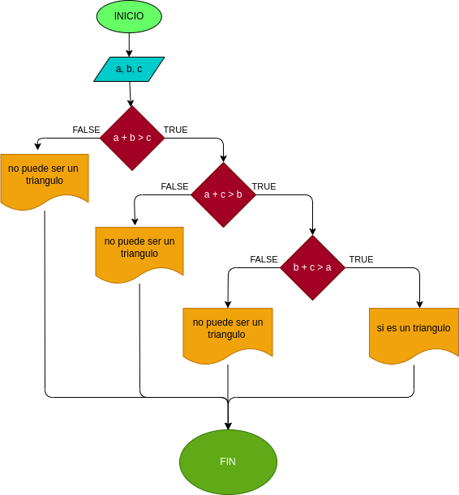

# Quiz instrucciones condicionales

### Realice el análisis, diseño y construcción para resolver el siguiente problema:

Dados tres números a, b y c, correspondientes a la longitud de los lados de una figura geométrica, determinar si pueden formar los lados de un triángulo.
# Analisis 

--Variables de entrada

a= Ingresar la longitud de uno de los lados
b= Ingresar la longitud de uno de los lados
c=  Ingresar la longitud de uno de los lados

--variables de proceso

a + b > c:
b + c > a:
c + a > b:

Para que pueda ser un triangulo

--Variables de salida

Resultado= Puede o no ser un triangulo con los angulos dados

--

## DISEÑO

### Diagrama de flujo
